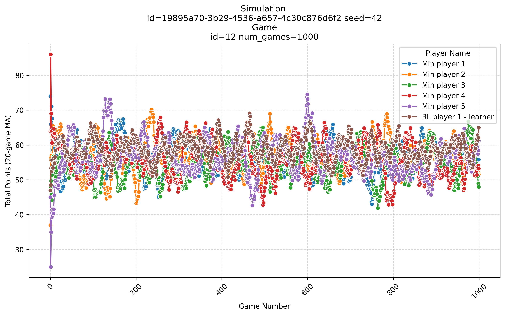
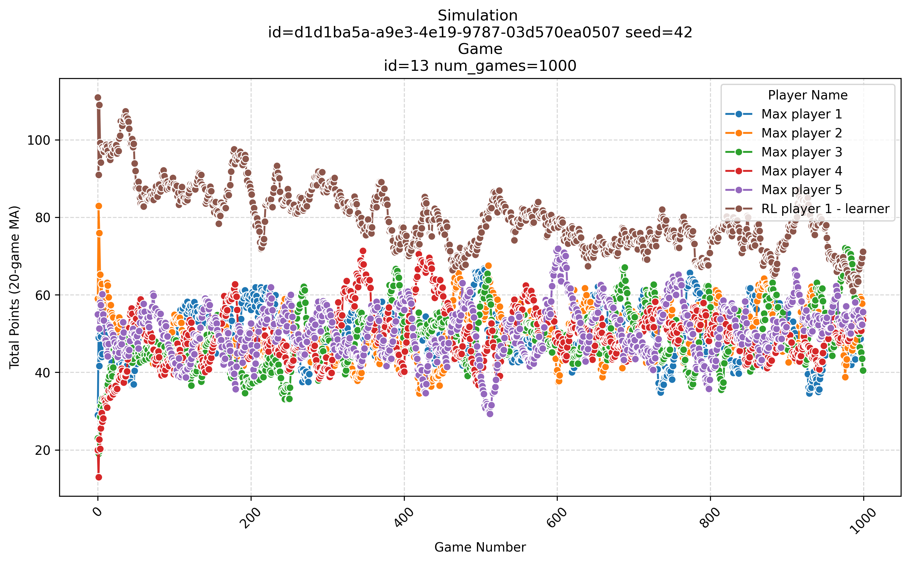
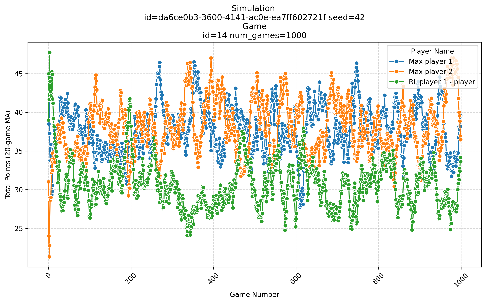
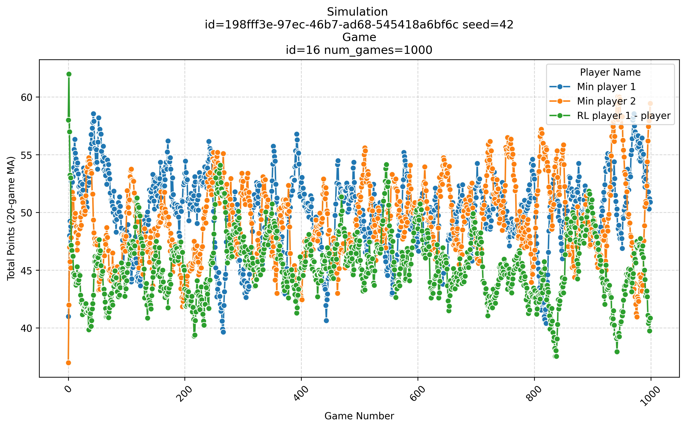

# Reinforcement Learning Experiments

This document outlines various experiments conducted in the field of reinforcement learning (RL).
The goal is to train players using RL techniques and evaluate their performance against different types of opponents.

Note that in this game, you depend also on the number of players and the other players' strategy.

## Experiment 1

The goal is to lay the foundations for more complex experiments.
A simple state representation and a basic action space will be used in this experiment.
Q-learning will be employed as the RL algorithm.

### State

To represent the state of the game, only the top card of each row will be considered (order matters).

The vector encoding are 4 dimensions, one for each row.
Each dimension can take a value from 0 to 11.
These represent the different buckets a card can be in.

For example, the board with top cards [12, 34, 56, 78] will be encoded as [1, 3, 5, 7].

Total number of states are 11^4 = 14641.

### Action

To represent the action space, only three actions are considered: low, medium, and high.
They represent the choice of playing the lowest, the middle, or highest card from the player's hand.

### Reward

For the reward, the negative of the points obtained in the turn will be used.
If no points are obtained, the reward is set to 1 to encourage it when taking the max action of Q.

### Training

#### Initial results

TL;DR: There is some learning in some cases. It is a good starting point.

The initial results of the experiment show that the RL player is able to learn a basic strategy.

When the RL player is trained against RANDOM players,
we can see a small learning curve and the player is able to win games at the end with 30-35 points.
This is a good starting point.

When the RL player is trained against MIN players, it is not able to learn a good strategy.

When the RL player is trained against MAX players, it is able to learn a better strategy achieving 10 points per game.

#### Tests with more players

TL;DR: The RL player is performing worst when playing with more players.
This could be due to the fact that the state representation does not encode the lengths of the rows
or the points in each row.

Let's see how the RL player performs with more players in the game.
When there are more players, the rows are filled faster in a single turn.

Against 5 RANDOM players, it can be seen that the RL player is not able to learn, and it performs very bad.

Against 5 MIN players, it also performs worst.

Against 5 MAX players, it looks like is learning something, but it is always losing against the others.

#### Change the reward

A change in the reward function was also tested.
Instead of using the negative of the points obtained in the turn,
the reward was set to -1 if the player took a row and 1 otherwise.

The results show that there is no improvements compared to the previous results.

### Evaluation

The learned Q-table was used to evaluate the RL player against different opponents.
The Q-table that was used for evaluation was the one obtained after training against 2 MAX players.

The results look as expected, the player is able to perform as well as the final of the training.

Against 2 MAX players it wins 95% of the games:

Against 2 RANDOM players it wins around 75% of the games:

Against 2 MIN players it wins around 55% of the games:

## Experiment 2

Does simplifying the state help compared to experiment 1?

### State

sorted top card

- TODO new player? refactor state and action to be inside the player?

### Action

low, medium, high

### Reward

### Training

- plot Q
- different number of players

### Evaluation

- against same environment
- new environment

## Experiment 3

Add more control to the action?

### State

top card (not sorted)

### Action

low, medium, high + row

### Reward

### Training

- plot Q
- different number of players

### Evaluation

- against same environment
- new environment